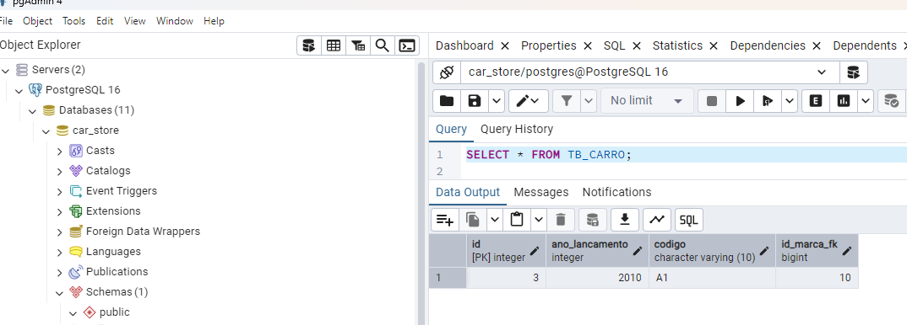
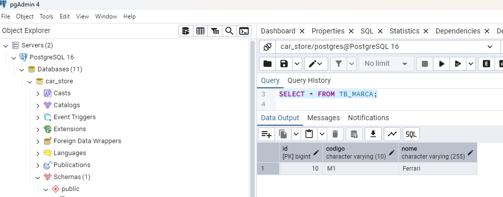
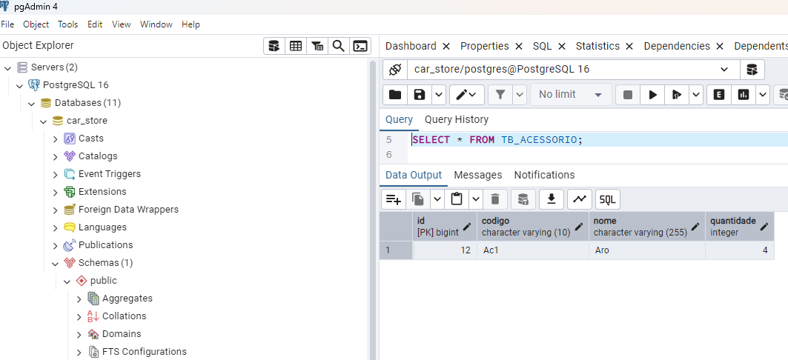
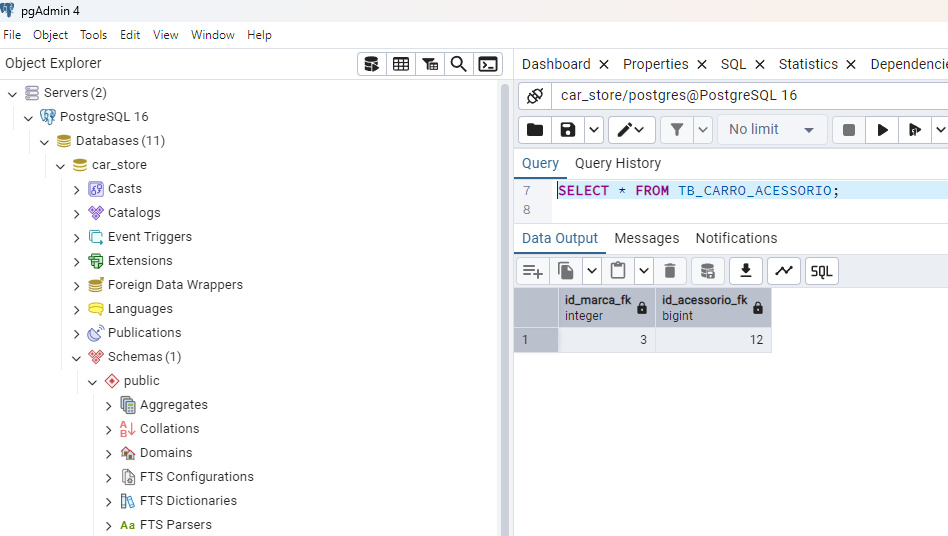

#  JPA (Entities Interactions)

## Módulo 33 - Especialista Back-end Java (EBAC)

### Palavras-chave

* IntelliJ IDE
* Java
* PostgreSQL
* JPA
* Hibernate
* SQL
* Persistence
* OnetoOne
* ManytoOne
* OnetoMany
* ManytoMany
* Generics

### Requisitos

1. Uma marca pode ter n carros, mas o carro só pode ter uma única marca;
2. Um acessório pode existir em n carros e o carro pode ter vários acessórios;

### Funcionalidades

1. Cadastrar entidades 'Carro','Marca' e 'Acessório' no banco de dados PostgreSQL, usando Annotations do JPA Hibernate para mapear os atributos com a tabela no BD.

### Principais passos:

1. Adicionar as bibliotecas do Postgres e do Hibernate ao Build Path do projeto;
2. Criação do dataset 'car_store' no postgreSQL;
3. Configurar o arquivo 'persistence.xml' com o nome do dataset criado e as credenciais de acesso (aqui foram deixadas credenciais aleatórias);
4. Adiciona as anotações (@Column, @Id e @GeneratedValue) aos atributos da classe 'Carro' e (@Entity, @Table) a própria classe 'Carro';
5. Adiciona as anotações @ManyToOne ao atributo 'marca' e @ManyToMany ao atributo 'acessorios' da entidade 'Carro';
6. Repete o passo 4 para a classe 'Marca';
7. Adiciona a anotação @OneToMany ao atributo 'carros' da entidade 'Marca';
8. Repete o passo 4 para a classe 'Acessório';
9. Adiciona a anotação @ManyToMany ao atributo 'carros' da entidade 'Acessorio';
10. Baseado na metodologia TDD, estrutura primeiro o test de cadastro e depois a carroDAO; O método carroDAO extende GenericsDAO.
11. Realiza o teste 'criarCarro';
12. Consulta a tabela 'TB_CARRO':

13. Consulta a tabela 'TB_MARCA':

14. Consulta a tabela 'TB_ACESSORIO':

15. Consulta a tabela provinda da relação ManytoMany entre a entidade 'Carro' e a entidade 'Acessório. 

### Licenças:

* Apache 2.0