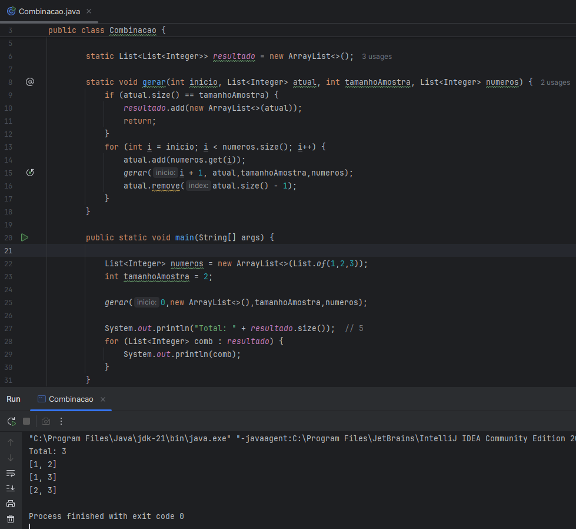
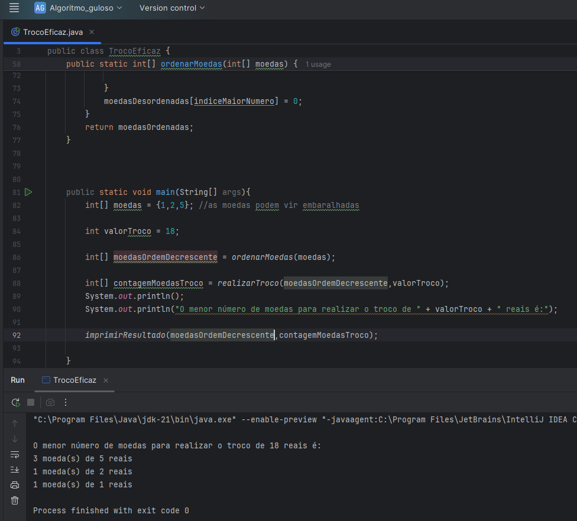

# Recursividade

## Módulo 46 - Especialista Back-end Java (EBAC)

### Palavras-chave

* Back-tracking
* Algoritmo guloso

### Funcionalidades

Calcular todas as combinações de números a partir de uma amostra usando o método de Backtracking.

### Exercício 1 – Dado um conjunto S de elementos únicos, calcule todos os seus subconjuntos de n elementos.

Screenshots dos resultado

Entrada: S = [1, 2, 3], n = 2 
Saída: [1, 2], [1, 3], [2, 3]

### Exercício 2 - Você tem que dar o troco de uma quantia em dinheiro usando o menor número possível de moedas.

