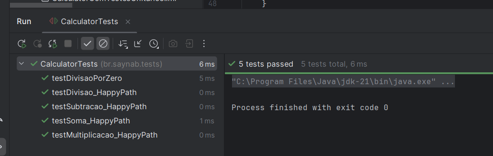
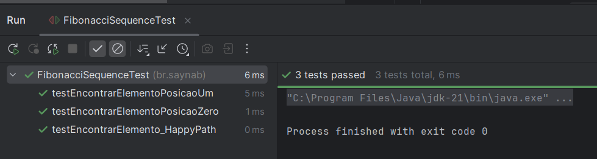

# Boas práticas e conceitos (Testes)

## Módulo 48 - Especialista Back-end Java (EBAC)

### Palavras-chave

* Boas práticas de escrita de código
* TDD
* Testes unitários
* Documentação

### Exercício 1 – Testes unitários

Escreva uma classe de nome Calculadora e que contenha os seguintes métodos:

private int adicionar(int a, int b)
private int subtrair(int a, int b)
private int multiplicar(int a, int b)
private int dividir (int a, int b)

Após isso, escreva os testes unitários para cada um dos métodos. Preste atenção em especial aos testes do método dividir!

________________________________________________________________________________________________

Todos os testes receberam nomenclaturas adequeadas para facilitar a identificação de qual unidade de código/método está sendo testada. Os testes realizados foram:

1. testSoma_HappyPath
2. testSubtracao_HappyPath
3. testMultiplicacao_HappyPath
4. testDivisao_HappyPath
5. testDivisaoPorZero

Segue screenshot do suíte de testes realizados:

### Exercício 2 - Ainda sobre testes unitários

Escreva testes unitários para o código recursivo da sequência de Fibonacci que foi apresentado no módulo de Algoritmos Avançados do curso.Tente escrever pelo menos três testes diferentes!

________________________________________________________________________________________________

Todos os testes receberam nomenclaturas adequeadas para facilitar a identificação de qual unidade de código/método está sendo testada. Os testes realizados foram:

1. testEncontrarElemento_HappyPath
2. testEncontrarElementoPosicaoZero
3. testEncontrarElementoPosicaoUm

Segue screenshot do suíte de testes realizados:

### Exercício 3 - Documentação de código

Documente a classe e os métodos que você escreveu no exercício 1.

Além disso, responda à seguinte pergunta: você conseguiria entender o código que escreveu sem documentá-lo? Justifique sua resposta. Será que foi mesmo necessário documentar este código?

Como foram utitilizadas boas práticas de código limpo, apenas o método de divisão recebeu um bloco de documentação em forma de comentário para esclarecer o caso de divisão por zero.

Antes de realizar a divisão dos números inteiros,um outro método chamado divisaoEhPossivel é chamado para validar se o denominador é zero ou não. Caso seja zero, a operação é inválida.

